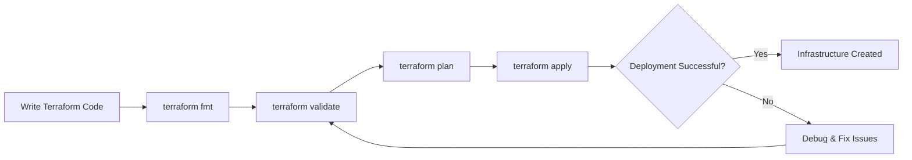
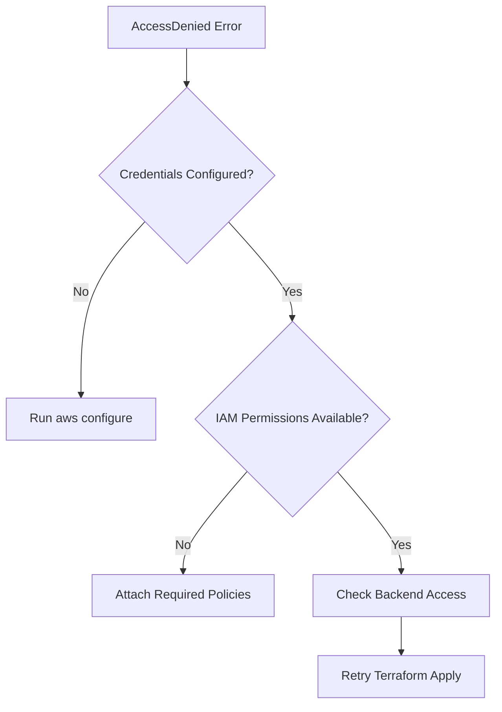
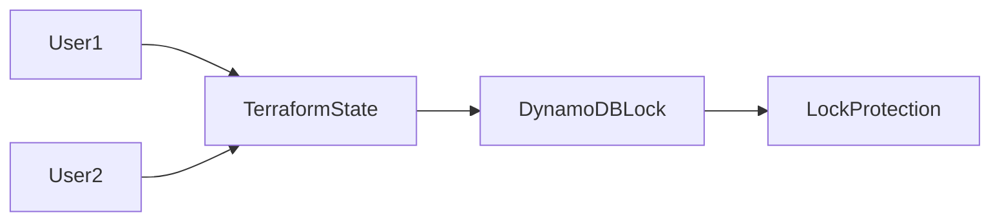
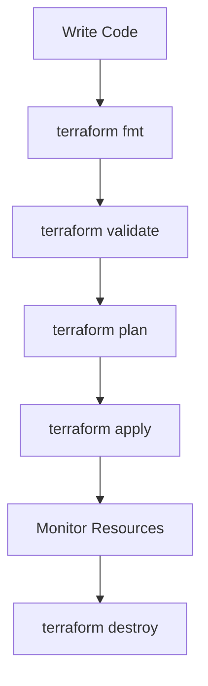

# 🚀 Terraform Debugging & Troubleshooting Guide


> A practical guide to diagnosing, troubleshooting, and fixing common Terraform issues encountered in real-world DevOps and Cloud environments.

---

## 📖 Overview

Terraform makes Infrastructure as Code (IaC) simple and repeatable. However, while provisioning cloud resources, engineers often face:

* Syntax errors
* Authentication failures
* State lock conflicts
* Provider issues
* Resource conflicts

This guide explains how to identify, troubleshoot, and resolve these problems efficiently while following industry best practices. 

---

# 📑 Table of Contents

* [Why Debugging Matters](#-why-debugging-matters)
* [Common Terraform Errors](#-common-terraform-errors)
* [Terraform Debugging Tools](#-terraform-debugging-tools)
* [Terraform Workflow](#-terraform-workflow)
* [Troubleshooting Matrix](#-troubleshooting-matrix)
* [Best Practices](#-best-practices)
* [Terraform Cheat Sheet](#-terraform-cheat-sheet)
* [Key Takeaways](#-key-takeaways)

---

# 🎯 Why Debugging Matters

Imagine you're deploying:

* EC2 Instances
* S3 Buckets
* VPC Networks
* Security Groups
* Databases

Everything looks correct, but Terraform throws:

```bash
Error: Access Denied: You do not have permission to create this resource
```

Now what?

Without proper debugging skills, identifying the root cause can take hours. Terraform provides powerful validation and logging tools that help quickly diagnose issues. 

---

## Terraform Deployment Lifecycle



---

# 🚨 Common Terraform Errors

---

## 1️⃣ Syntax Errors

### Example Error

```bash
Error: Unsupported argument

on main.tf line 5:
invalid_option = true
```

### Why It Happens

* Typographical mistakes
* Unsupported arguments
* Invalid resource configuration

### Example

❌ Incorrect

```hcl
resource "aws_s3_bucket" "example" {
  invalid_option = true
}
```

✅ Correct

```hcl
resource "aws_s3_bucket" "example" {
  bucket = "my-terraform-bucket"
}
```

### Fix

Run:

```bash
terraform validate
```

Terraform will identify syntax and configuration issues before deployment. 

---

## 2️⃣ Authentication & Permission Issues

### Example Error

```bash
Error: AccessDenied
You do not have permission to perform this action
```

### Why It Happens

* Incorrect AWS credentials
* Missing IAM permissions
* Azure Service Principal lacks required role
* No access to remote state backend

---

### Troubleshooting Flow



### Verification Commands

AWS:

```bash
aws configure
aws s3 ls
```

Azure:

```bash
az account show
```

If these commands fail, your credentials or permissions are incorrect. 

---

## 3️⃣ Resource Already Exists

### Example Error

```bash
Error: BucketAlreadyExists
```

### Why It Happens

Terraform attempts to create a resource that already exists.

Example:

S3 bucket names are globally unique.

---

### Fix

Use a unique name:

```hcl
bucket = "my-unique-terraform-bucket-1234"
```

Or:

```hcl
resource "random_id" "bucket" {
  byte_length = 4
}

bucket = "my-bucket-${random_id.bucket.hex}"
```

Always review changes before deployment:

```bash
terraform plan
```


---

## 4️⃣ Terraform State Lock Issues

### Example Error

```bash
Error acquiring the state lock

Reason:
The state file is locked by another process
```

### Why It Happens

* Multiple engineers running Terraform simultaneously
* Interrupted Terraform execution
* Lock not released correctly

---

### State Lock Architecture



### Fix

Force unlock:

```bash
terraform force-unlock LOCK_ID
```

Or manually remove lock:

```bash
aws dynamodb delete-item \
--table-name terraform-lock \
--key '{"LockID":{"S":"terraform.tfstate"}}'
```

Ensure no one else is running Terraform. 

---

## 5️⃣ Provider Plugin Not Found

### Example Error

```bash
Error:
Provider registry.terraform.io/hashicorp/aws not found
```

### Why It Happens

* Missing provider plugin
* Corrupted plugin cache
* Outdated Terraform version

### Fix

Initialize providers:

```bash
terraform init
```

Upgrade providers:

```bash
terraform init -upgrade
```

Verify version:

```bash
terraform version
```


---

# 🛠 Terraform Debugging Tools

---

## 1. terraform plan

Preview infrastructure changes before deployment.

```bash
terraform plan
```

### Benefits

✅ Detects issues early

✅ Shows resources to be added

✅ Prevents accidental destruction

---

## 2. terraform validate

Validate Terraform syntax.

```bash
terraform validate
```

### Benefits

✅ Detects configuration mistakes

✅ Fast and lightweight

---

## 3. TF_LOG Debugging

Enable detailed Terraform logs.

### Linux / macOS

```bash
export TF_LOG=DEBUG
terraform apply
```

### Windows PowerShell

```powershell
$env:TF_LOG="DEBUG"
terraform apply
```

### Save Logs to File

```bash
export TF_LOG_PATH=terraform.log
terraform apply
```

Terraform outputs detailed internal operations for troubleshooting. 

---

## 4. terraform state list

View resources managed by Terraform.

```bash
terraform state list
```

Inspect resource details:

```bash
terraform state show aws_s3_bucket.example_bucket
```

Useful when Terraform state and actual infrastructure appear inconsistent. 

---

# 🔄 Terraform Workflow



---

# 📊 Troubleshooting Matrix

| Error                | Root Cause              | Fix                   |
| -------------------- | ----------------------- | --------------------- |
| Unsupported Argument | Syntax issue            | terraform validate    |
| AccessDenied         | IAM permissions         | Configure credentials |
| BucketAlreadyExists  | Duplicate resource      | Rename resource       |
| State Lock Error     | Concurrent modification | Unlock state          |
| Provider Not Found   | Missing plugin          | terraform init        |
| Terraform Drift      | Manual cloud changes    | terraform refresh     |

---

# ✅ Best Practices

### Before Every Deployment

```bash
terraform fmt
terraform validate
terraform plan
```

### Production Best Practices

* Store state remotely (S3, Azure Storage, Terraform Cloud)
* Enable state locking
* Use Git for version control
* Apply least-privilege IAM policies
* Review every plan before apply
* Keep Terraform updated
* Use modules for reusable code
* Enable logging and monitoring


---

# ⚡ Terraform Cheat Sheet

<details>
<summary>📌 Click to Expand</summary>

### Initialization

```bash
terraform init
```

### Format Code

```bash
terraform fmt
```

### Validate Configuration

```bash
terraform validate
```

### Preview Changes

```bash
terraform plan
```

### Apply Changes

```bash
terraform apply
```

### Destroy Infrastructure

```bash
terraform destroy
```

### List State Resources

```bash
terraform state list
```

### Inspect Resource

```bash
terraform state show RESOURCE_NAME
```

### Check Terraform Version

```bash
terraform version
```

### Enable Debug Logging

```bash
export TF_LOG=DEBUG
terraform apply
```

</details>

---

# 🎓 Key Takeaways

By mastering Terraform troubleshooting, you can:

✅ Resolve deployment failures faster

✅ Prevent infrastructure downtime

✅ Improve cloud deployment reliability

✅ Troubleshoot state-related issues

✅ Debug authentication and permission errors

✅ Work effectively in production environments

---

## 🌟 If this guide helped you...

Give the repository a ⭐ and share it with fellow DevOps Engineers!

### 🔗 Related Topics

* Terraform State Management
* Terraform Modules
* AWS IAM Best Practices
* CI/CD with Terraform
* Terraform Remote Backends

---

**Happy Terraforming! 🚀**
